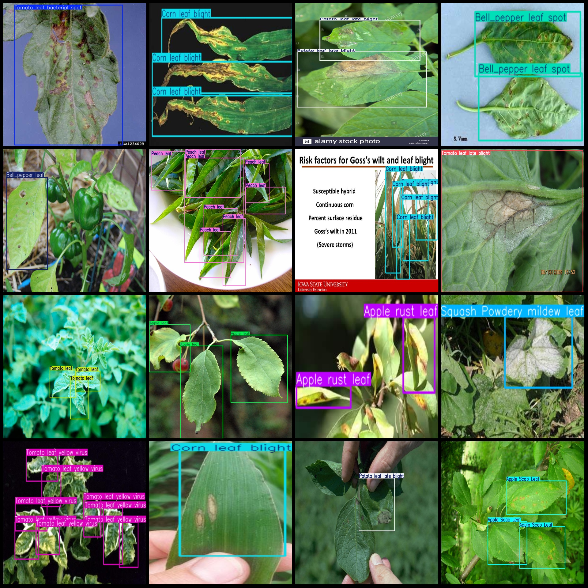
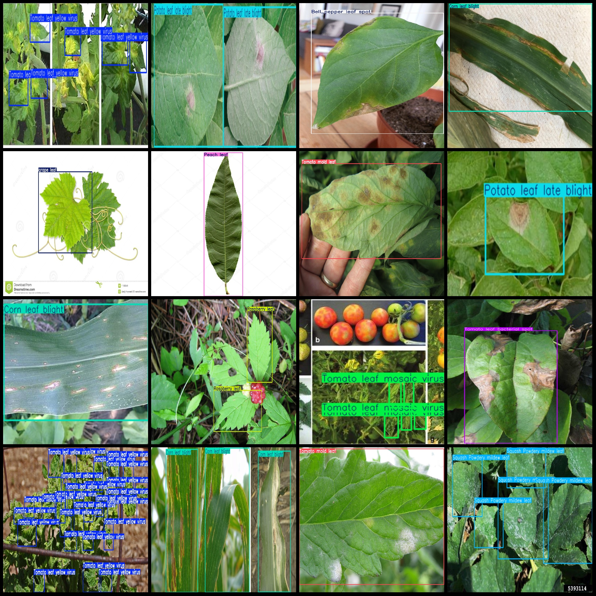

# 13 Types of Plant Leaf Disease Detection Dataset in VOC+YOLO format with 2258 images and 30 categories

The dataset format is as follows: Pascal VOC format + YOLO format (without split path, only txtfile containing jpgimage and corresponding VOC format xmlfile and yolo format txtfile).
number of images: 2558  
annotation count: 2558  
annotation count: 2558  
annotationnumber of classes: 30  
Repository: firc-dataset  
Annotation class names (Note that the order of yolo formatclass does not match this, and should be based on the labelsfile/classes.txt): ["Apple Scab Leaf", "Apple leaf", "Apple rust leaf", "Bell_pepper leaf", "Bell_pepper leaf spot", "Blueberry leaf", "Cherry leaf", "Corn Gray leaf spot", "Corn leaf blight", "Corn rust leaf", "Peach leaf", "Potato leaf", "Potato leaf early blight", "Potato leaf late blight", "Raspberry leaf", "Soyabean leaf", "Soybean leaf", "Squash Powdery mildew leaf", "Strawberry leaf", "Tomato Early blight leaf", "Tomato Septoria leaf spot", "Tomato leaf", "Tomato leaf bacterial spot", "Tomato leaf late blight", "Tomato leaf mosaic virus", "Tomato leaf yellow virus", "Tomato mold leaf", "Tomato two spotted spider mites leaf", "grape leaf", "grape leaf black rot"]
boxes per class:   
Apple Scab Leaf box count = 171
Apple leaf box count = 247
Apple rust leaf box count = 178
Bell_pepper leaf box count = 323
Bell_pepper leaf spot box count = 263
Blueberry leaf box count = 838
Cherry leaf box count = 239
Corn Gray Leaf Spot (76 frames)
Corn Leaf Blight (368 frames)
Corn Rust Leaf (127 frames)
Peach Leaf (614 frames)
Potato Leaf (11 frames)
Potato Leaf Early Blight (318 frames)
Potato Leaf Late Blight (245 frames)
Raspberry Leaf (556 frames)
Soybean Leaf (266 frames)
Soybean Leaf (266 frames)
Squash Powdery Mildew Leaf (256 frames)
Strawberry Leaf (492 frames)
Tomato Early Blight Leaf (212 frames)
Tomato Septoria Leaf Spot (426 frames)
Tomato Leaf (400 frames)
Tomato leaf bacterial spot (280)
Tomato leaf late blight (late blight of tomato leaves) frame count = 218
Tomato leaf mosaic virus (ToMV) is a potexvirus that infects plants, causing symptoms such as yellowing of leaves and petioles, chlorosis, necrosis, and stunting. It is transmitted by aphids, whiteflies, and other insects. The disease is widespread in the world, affecting many different plant species, including tomatoes, peppers, eggplants, potatoes, and beans.
Tomato leaf yellow virus frame count = 801
Tomato mold leaf box count = 295
Tomato two spotted spider mites leaf box count = 2
Grape leaf frame count = 220
grape leaf black rot box count = 133
total boxes: 8851  
Image resolution: Multi-resolution images, such as 600x668, 640x640, etc.
Using the annotation tool: labelImg
Annotation rules: Draw a rectangle around the class.
Important notes: There are no notes at this time.
Special Disclaimer: This dataset does not guarantee the accuracy of the trained model or weight files.
Image preview:
## Image

Here is a pay link on Stripe ( https://buy.stripe.com/3cs8yP7sY87d0vu9AB ). Please contact me lonlonago@foxmail.com after funding $89, and I will send you a complete data files , thank you!

